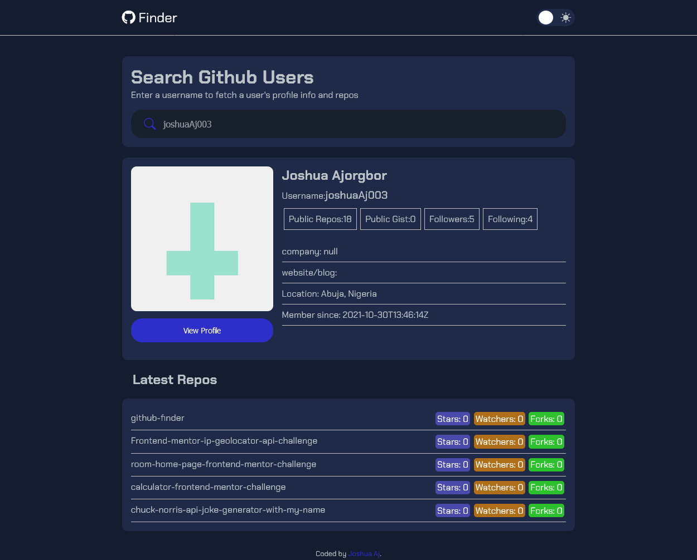

#  GITHUB FINDER SEARCH APP


## Table of contents

- [Overview](#overview)
  - [Screenshot](#screenshot)
  - [Links](#links)

  - [Built with](#built-with)
  - [What I learned](#what-i-learned)
  - [Continued development](#continued-development)

- [Author](#author)


## Overview
This is a modification of the github finder mini project from Brad Traversy's javascript course, the major modifications made where the slight changes in the design and layout, the addition of a theme switching functionality and the use of XMLHttpRequests to fetch data from the Github Rest API rather than the asyn and await approach taken in the javascript course.
### The challenge

Users should be able to:

- View the optimal layout for the site depending on their device's screen size
- See hover states for all interactive elements on the page
- Search Github usernames to see the profile info and latest 5 repository of the user
- Change the color theme of the website 

### Screenshot



### Links
- Live Site URL: [cick here to see the live site](https://JAjorgbor.github.io/github-finder/)

## My process
I built the layout with html and scss with relevant breakpoints for responsiveness, afterwhich I used the Github profile Api by using the XMLHttpRequest method to generate user data and javasctipt to output the data on the Dom. 

### Built with

- Semantic HTML5 markup
- CSS custom properties
- Flexbox
- CSS Grid
- Mobile-first workflow
- Vanilla Javascript 
- SASS
- RESt Api

### What I learned
I learnt how to use javascript Es5 object oriented programing feautures such as prototypes and constructors, as well as how to fetch data from an Api using XMLHttpRequests.
```js
Github.prototype.getUser=function(error,user,callback,forbidden){
    if(user==undefined){    
        user="JAjorgbor";
    }    
    const http=new XMLHttpRequest();
    const url=`https://api.github.com/users/${user}?client_id=${this.clientId}&client_secret${this.clientSecret}`
      http.open("GET",url,true);
      http.onload= ()=>{  
        if(user!=="" && !user.includes(" ")){

            if (http.status==200){


                let response=JSON.parse(http.responseText);
                callback(response);
            }   
            else if( http.status==404){
                callback(error);
            }
            else if( http.status==403){
                forbidden=true;
                callback(forbidden);
            }
        }
        
    }
    http.send()
}
```


### Continued development

I would like to learn how to better use promises and callback functions when building applications as well as how to perform the other http requests such as; PUT,POSt and DELETE
## Author
- Twitter - [@yourusername](https://www.twitter.com/jAjorgbor)
- LinkedIn - [my LinkedIn](https://www.linkedin.com/in/joshua-ajorgbor-b0bba6227/)
